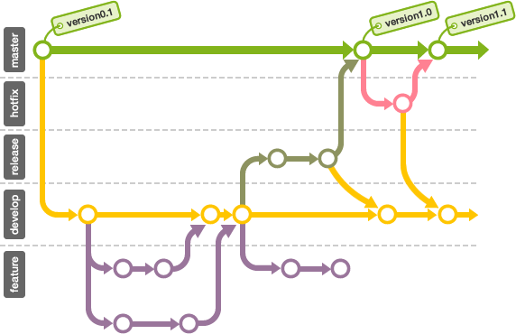

##  성공적인 Git Branch 운용모델

### 1. 메인 브랜치(Main branch)
* **master 브랜치** : **배포가능한 상태만 관리**. 커밋 시 태그 사용하여 배포번호 기록.
* **develop 브랜치** : 통합 브랜치의 역할. 기본 개발 용도.

### 2. 피쳐 브랜치(Feature branch, Topic branch)
* **새로운 기능 개발 및 버그 수정**이 필요할 시, develop 브랜치로부터 분기. 
* 피쳐 브랜치의 작업은 **공유할 필요 없음 → 원격으로는 관리 안 함.**
* 개발 완료 시, develop 브랜치로 병합하여 공유.

### 3. 릴리즈 브랜치(Release branch)
* 버그를 수정하거나 새로운 기능을 포함한 상태로 **릴리즈 전 모든 기능이 정상적으로 동작하는 지를 확인**하는 용도.
* 브랜치 이름 접두어:  **release-**
* 릴리즈를 위한 최종적인 버그 수정 등의 개발을 수행. 다음 번 릴리즈를 위한 개발은 develop 브랜치에서 계속 진행하면 됨.
* 모든 준비를 마치고 배포 가능한 상태가 되면 master 브랜치로 병합시키고, **병합한 커밋에 릴리즈 번호 태그 추가.**
* 릴리즈 브랜치의 수정 사항은 **배포 완료 후 develop 브랜치에 병합.**

### 4. 핫픽스 브랜치(Hotfix branch)
* **배포한 버전에 긴급한 수정이 필요할 경우**, **master 브랜치에서 분기**하는 브랜치.
* 브랜치 이름 접두어:  **hotfix-**
* 핫픽스 브랜치의 수정 사항은 **배포 완료 후 develop 브랜치에 병합.**

 

>- [출처원문](http://nvie.com/posts/a-successful-git-branching-model/)
>- [참고사이트](https://backlog.com/git-tutorial/kr/stepup/stepup1_5.html)